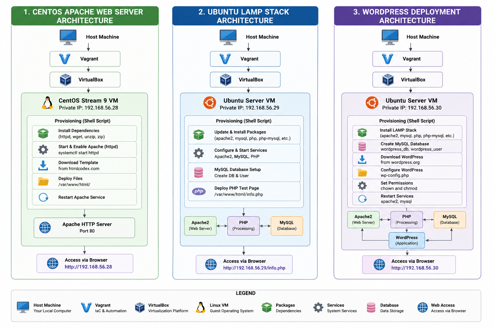

# Infrastructure Automation with Vagrant

A collection of hands-on DevOps and Infrastructure as Code (IaC) labs built using Vagrant and VirtualBox. This repository demonstrates automated virtual machine provisioning, Linux server administration, web server deployment, and application hosting through reproducible infrastructure configurations.


## Architecture Overview

<p align="center">
  
</p>

<p align="center">
  <em>High-level architecture of the Vagrant-based infrastructure automation projects included in this repository.</em>
</p>

---


## Overview

This repository contains beginner-level infrastructure automation projects designed to explore core DevOps concepts such as:

* Infrastructure as Code (IaC)
* Automated server provisioning
* Linux system administration
* Web server deployment
* LAMP stack configuration
* Application hosting automation

All environments are created using Vagrant, enabling consistent and repeatable infrastructure setup.

## Technologies Used

* Vagrant
* VirtualBox
* CentOS Stream 9
* Ubuntu Server
* Apache HTTP Server (httpd)
* MySQL
* PHP
* WordPress
* Linux Shell Scripting

---

## Projects Included

### 1. CentOS Apache Web Server Automation

Automated the provisioning of a CentOS Stream 9 virtual machine and configured an Apache HTTP Server using Vagrant shell provisioning.

#### Features

* Automated VM creation
* Apache HTTP Server installation
* Service management and configuration
* Automated website deployment
* Dynamic HTML template deployment
* Private network configuration

#### Learning Outcomes

* Linux server management
* Apache administration
* Shell provisioning
* Infrastructure as Code fundamentals

---

### 2. Ubuntu LAMP Stack Deployment

Configured a complete LAMP (Linux, Apache, MySQL, PHP) environment on Ubuntu using automated provisioning.

#### Features

* Ubuntu server provisioning
* Apache installation and configuration
* MySQL database setup
* PHP environment configuration
* Dynamic web application hosting

#### Learning Outcomes

* LAMP stack architecture
* Service management
* Database administration basics
* Linux web hosting

---

### 3. WordPress Deployment Automation

Automated the deployment of a WordPress environment using Vagrant provisioning and Linux automation techniques.

#### Features

* Automated WordPress deployment
* Database configuration
* Apache web server integration
* Application provisioning
* Repeatable environment setup

#### Learning Outcomes

* Application deployment automation
* Web hosting fundamentals
* Infrastructure reproducibility
* DevOps workflow basics

---

## Getting Started

### Prerequisites

* Vagrant
* VirtualBox

### Clone Repository

```bash
git clone <repository-url>
cd infrastructure-automation-vagrant
```

### Start Environment

```bash
vagrant up
```

### Access Virtual Machine

```bash
vagrant ssh
```

### Destroy Environment

```bash
vagrant destroy
```

## Key Concepts Practiced

* Infrastructure as Code (IaC)
* Automated Provisioning
* Linux Administration
* Web Server Management
* Application Deployment
* Environment Consistency
* Reproducible Infrastructure

## Purpose

This repository was created as part of my DevOps learning journey to gain practical experience with infrastructure automation, Linux server administration, and repeatable environment provisioning before progressing to modern cloud-native technologies such as Docker, Kubernetes, Terraform, CI/CD, and AWS.

## Future Improvements

* Ansible-based provisioning
* Dockerized deployments
* Terraform integration
* CI/CD automation
* NGINX reverse proxy setup
* Monitoring with Prometheus and Grafana

## Author

**Eranga Kavishanka**

Software Engineering Undergraduate | DevOps & Cloud Enthusiast